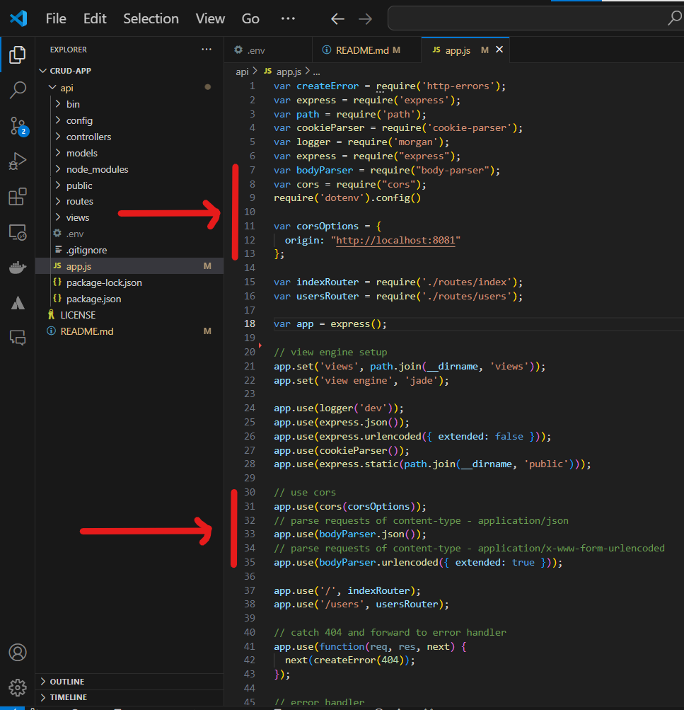
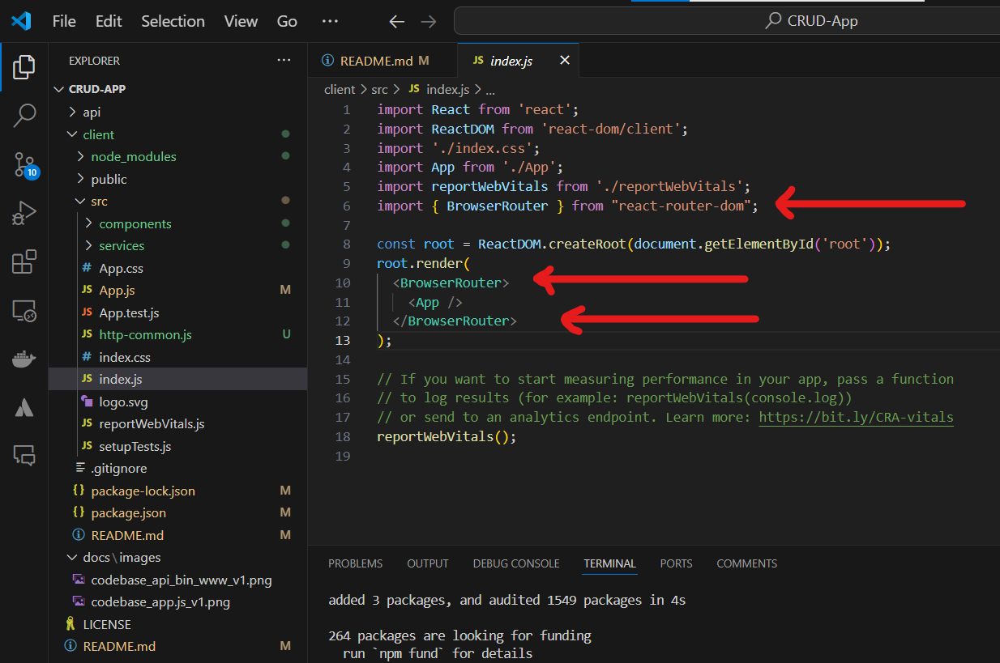

# CRUD-App
React + Node.js + Express + PostgreSQL example: Build a CRUD App

## How to start (Expressjs backend api)

```bash
mkdir CRUD-APP
cd CRUD-APP
```

### Create Express App

```bash
npx express-generator api
cd api
npm install
npm start
```

Install Dependencies

### Create Express App

In api folder run the next command to install necessary packages

```bash
npm install express sequelize pg pg-hstore body-parser cors --save
```

add this code to app.js

```bash
var bodyParser = require("body-parser");
var cors = require("cors");
require('dotenv').config()

...

// use cors
app.use(cors(corsOptions));
// parse requests of content-type - application/json
app.use(bodyParser.json());
// parse requests of content-type - application/x-www-form-urlencoded
app.use(bodyParser.urlencoded({ extended: true }));
```

It should look like this:



express app default port is 3000, set it to 8080 in file api/bin/www like this


### Configure  PostgreSQL  database & Sequelize

In the app folder, we create a separate config folder for configuration with db.config.js file like this:

```js
module.exports = {
    HOST: process.env.DB_HOST,
    USER: process.env.DB_USER,
    PASSWORD: process.env.DB_PASSWORD,
    DB: process.env.DB_NAME,
    dialect: process.env.DB_DIALECT,
    PORT: process.env.DB_PORT,
    pool: {
      max: parseInt(process.env.DB_POOL_MAX),
      min: parseInt(process.env.DB_POOL_MIN),
      acquire: parseInt(process.env.DB_POOL_ACQUIRE),
      idle: parseInt(process.env.DB_POOL_IDLE)
    }
  };
```

under api directory add this file as .env for express to read variable values

```
DB_HOST=localhost
DB_USER=crudappuser
DB_PASSWORD=crudapppwd
DB_NAME=crudappdb
DB_DIALECT=postgres
DB_PORT=5433
DB_POOL_MAX=5
DB_POOL_MIN=0
DB_POOL_ACQUIRE=30000
DB_POOL_IDLE=10000
```

#### Initialize Sequelize

Now create app/models/index.js with the following code:

``` js
const dbConfig = require("../config/db.config.js");

const Sequelize = require("sequelize");
const sequelize = new Sequelize(dbConfig.DB, dbConfig.USER, dbConfig.PASSWORD, {
  host: dbConfig.HOST,
  dialect: dbConfig.dialect,
  operatorsAliases: false,
  port: dbConfig.PORT,
  pool: {
    max: dbConfig.pool.max,
    min: dbConfig.pool.min,
    acquire: dbConfig.pool.acquire,
    idle: dbConfig.pool.idle
  }
});

const db = {};

db.Sequelize = Sequelize;
db.sequelize = sequelize;

db.tutorials = require("./tutorial.model.js")(sequelize, Sequelize);

module.exports = db;
```

Don’t forget to call sync() method in server.js:

```js
const app = express();
app.use(...);

const db = require("./app/models");
db.sequelize.sync();
```

In development, you may need to drop existing tables and re-sync database. Just use force: true as following code:

```js
db.sequelize.sync({ force: true }).then(() => {
  console.log("Drop and re-sync db.");
});
```

#### Define the Sequelize Model

In models folder, create tutorial.model.js file like this:

```js
module.exports = (sequelize, Sequelize) => {
  const Tutorial = sequelize.define("tutorial", {
    title: {
      type: Sequelize.STRING
    },
    description: {
      type: Sequelize.STRING
    },
    published: {
      type: Sequelize.BOOLEAN
    }
  });

  return Tutorial;
};
```

#### Create Controllers

Inside app/controllers folder, let’s create tutorial.controller.js with these CRUD functions:

create
findAll
findOne
update
delete
deleteAll
findAllPublished

```js
const db = require("../models");
const Tutorial = db.tutorials;
const Op = db.Sequelize.Op;

// Create and Save a new Tutorial
exports.create = (req, res) => {
  
};

// Retrieve all Tutorials from the database.
exports.findAll = (req, res) => {
  
};

// Find a single Tutorial with an id
exports.findOne = (req, res) => {
  
};

// Update a Tutorial by the id in the request
exports.update = (req, res) => {
  
};

// Delete a Tutorial with the specified id in the request
exports.delete = (req, res) => {
  
};

// Delete all Tutorials from the database.
exports.deleteAll = (req, res) => {
  
};

// Find all published Tutorials
exports.findAllPublished = (req, res) => {
  
};
```

#### Run the Node.js Express Server

```bash
npm start
```

## React.js Front-end

Setup React.js Project

```bash
cd CRUD-APP
npx create-react-app client
```

Import Bootstrap to  React CRUD App
```bash
cd client
npm install bootstrap
```

Open client/src/App.js and add this import at the top

```js
import "bootstrap/dist/css/bootstrap.min.css";
```

### Add React Router to React CRUD App

Import Bootstrap to  React CRUD App
```bash
npm install react-router-dom
```

Open src/index.js and wrap App component by BrowserRouter object.



### Initialize Axios for React CRUD HTTP Client
Let’s install axios with command:
```bash
npm install axios
```
Under src folder, we create http-common.js file with following code:
```js
import axios from "axios";

export default axios.create({
  baseURL: "http://localhost:8080/api",
  headers: {
    "Content-type": "application/json"
  }
});
```
### Create Data Service

In this step, we’re gonna create a service that uses axios object above to send HTTP requests.

services/tutorial.service.js

```js
import http from "../http-common";

class TutorialDataService {
  getAll() {
    return http.get("/tutorials");
  }

  get(id) {
    return http.get(`/tutorials/${id}`);
  }

  create(data) {
    return http.post("/tutorials", data);
  }

  update(id, data) {
    return http.put(`/tutorials/${id}`, data);
  }

  delete(id) {
    return http.delete(`/tutorials/${id}`);
  }

  deleteAll() {
    return http.delete(`/tutorials`);
  }

  findByTitle(title) {
    return http.get(`/tutorials?title=${title}`);
  }
}

export default new TutorialDataService();

```

In src folder, create common/with-router.js file with following code:

```js
import { useLocation, useNavigate, useParams } from "react-router-dom";

export const withRouter = (Component) => {
  function ComponentWithRouterProp(props) {
    let location = useLocation();
    let navigate = useNavigate();
    let params = useParams();
    return <Component {...props} router={{ location, navigate, params }} />;
  }
  return ComponentWithRouterProp;
};
```

### Create React Components

Add item Component

components/add-tutorial.component.js

```js
import React, { Component } from "react";
import TutorialDataService from "../services/tutorial.service";

export default class AddTutorial extends Component {
  constructor(props) {
    super(props);
    this.onChangeTitle = this.onChangeTitle.bind(this);
    this.onChangeDescription = this.onChangeDescription.bind(this);
    this.saveTutorial = this.saveTutorial.bind(this);
    this.newTutorial = this.newTutorial.bind(this);

    this.state = {
      id: null,
      title: "",
      description: "", 
      published: false,

      submitted: false
    };
  }

  onChangeTitle(e) {
    this.setState({
      title: e.target.value
    });
  }

  onChangeDescription(e) {
    this.setState({
      description: e.target.value
    });
  }

  saveTutorial() {
    var data = {
      title: this.state.title,
      description: this.state.description
    };

    TutorialDataService.create(data)
      .then(response => {
        this.setState({
          id: response.data.id,
          title: response.data.title,
          description: response.data.description,
          published: response.data.published,

          submitted: true
        });
        console.log(response.data);
      })
      .catch(e => {
        console.log(e);
      });
  }

  newTutorial() {
    this.setState({
      id: null,
      title: "",
      description: "",
      published: false,

      submitted: false
    });
  }

  render() {
    return (
      <div className="submit-form">
        {this.state.submitted ? (
          <div>
            <h4>You submitted successfully!</h4>
            <button className="btn btn-success" onClick={this.newTutorial}>
              Add
            </button>
          </div>
        ) : (
          <div>
            <div className="form-group">
              <label htmlFor="title">Title</label>
              <input
                type="text"
                className="form-control"
                id="title"
                required
                value={this.state.title}
                onChange={this.onChangeTitle}
                name="title"
              />
            </div>

            <div className="form-group">
              <label htmlFor="description">Description</label>
              <input
                type="text"
                className="form-control"
                id="description"
                required
                value={this.state.description}
                onChange={this.onChangeDescription}
                name="description"
              />
            </div>

            <button onClick={this.saveTutorial} className="btn btn-success">
              Submit
            </button>
          </div>
        )}
      </div>
    );
  }
}

```

components/tutorial.component.js

```js
import React, { Component } from "react";
import TutorialDataService from "../services/tutorial.service";
import { withRouter } from '../common/with-router';

class Tutorial extends Component {
  constructor(props) {
    super(props);
    this.onChangeTitle = this.onChangeTitle.bind(this);
    this.onChangeDescription = this.onChangeDescription.bind(this);
    this.getTutorial = this.getTutorial.bind(this);
    this.updatePublished = this.updatePublished.bind(this);
    this.updateTutorial = this.updateTutorial.bind(this);
    this.deleteTutorial = this.deleteTutorial.bind(this);

    this.state = {
      currentTutorial: {
        id: null,
        title: "",
        description: "",
        published: false
      },
      message: ""
    };
  }

  componentDidMount() {
    this.getTutorial(this.props.router.params.id);
  }

  onChangeTitle(e) {
    const title = e.target.value;

    this.setState(function(prevState) {
      return {
        currentTutorial: {
          ...prevState.currentTutorial,
          title: title
        }
      };
    });
  }

  onChangeDescription(e) {
    const description = e.target.value;
    
    this.setState(prevState => ({
      currentTutorial: {
        ...prevState.currentTutorial,
        description: description
      }
    }));
  }

  getTutorial(id) {
    TutorialDataService.get(id)
      .then(response => {
        this.setState({
          currentTutorial: response.data
        });
        console.log(response.data);
      })
      .catch(e => {
        console.log(e);
      });
  }

  updatePublished(status) {
    var data = {
      id: this.state.currentTutorial.id,
      title: this.state.currentTutorial.title,
      description: this.state.currentTutorial.description,
      published: status
    };

    TutorialDataService.update(this.state.currentTutorial.id, data)
      .then(response => {
        this.setState(prevState => ({
          currentTutorial: {
            ...prevState.currentTutorial,
            published: status
          }
        }));
        console.log(response.data);
      })
      .catch(e => {
        console.log(e);
      });
  }

  updateTutorial() {
    TutorialDataService.update(
      this.state.currentTutorial.id,
      this.state.currentTutorial
    )
      .then(response => {
        console.log(response.data);
        this.setState({
          message: "The tutorial was updated successfully!"
        });
      })
      .catch(e => {
        console.log(e);
      });
  }

  deleteTutorial() {    
    TutorialDataService.delete(this.state.currentTutorial.id)
      .then(response => {
        console.log(response.data);
        this.props.router.navigate('/tutorials');
      })
      .catch(e => {
        console.log(e);
      });
  }

  render() {
    const { currentTutorial } = this.state;

    return (
      <div>
        {currentTutorial ? (
          <div className="edit-form">
            <h4>Tutorial</h4>
            <form>
              <div className="form-group">
                <label htmlFor="title">Title</label>
                <input
                  type="text"
                  className="form-control"
                  id="title"
                  value={currentTutorial.title}
                  onChange={this.onChangeTitle}
                />
              </div>
              <div className="form-group">
                <label htmlFor="description">Description</label>
                <input
                  type="text"
                  className="form-control"
                  id="description"
                  value={currentTutorial.description}
                  onChange={this.onChangeDescription}
                />
              </div>

              <div className="form-group">
                <label>
                  <strong>Status:</strong>
                </label>
                {currentTutorial.published ? "Published" : "Pending"}
              </div>
            </form>

            {currentTutorial.published ? (
              <button
                className="badge badge-primary mr-2"
                onClick={() => this.updatePublished(false)}
              >
                UnPublish
              </button>
            ) : (
              <button
                className="badge badge-primary mr-2"
                onClick={() => this.updatePublished(true)}
              >
                Publish
              </button>
            )}

            <button
              className="badge badge-danger mr-2"
              onClick={this.deleteTutorial}
            >
              Delete
            </button>

            <button
              type="submit"
              className="badge badge-success"
              onClick={this.updateTutorial}
            >
              Update
            </button>
            <p>{this.state.message}</p>
          </div>
        ) : (
          <div>
            <br />
            <p>Please click on a Tutorial...</p>
          </div>
        )}
      </div>
    );
  }
}

export default withRouter(Tutorial);
```


List of items Component
This component has:

a search bar for finding Tutorials by title.
a tutorials array displayed as a list on the left.
a selected Tutorial which is shown on the right.

components/tutorials-list.component.js

```js
import React, { Component } from "react";
import TutorialDataService from "../services/tutorial.service";
import { Link } from "react-router-dom";

export default class TutorialsList extends Component {
  constructor(props) {
    super(props);
    this.onChangeSearchTitle = this.onChangeSearchTitle.bind(this);
    this.retrieveTutorials = this.retrieveTutorials.bind(this);
    this.refreshList = this.refreshList.bind(this);
    this.setActiveTutorial = this.setActiveTutorial.bind(this);
    this.removeAllTutorials = this.removeAllTutorials.bind(this);
    this.searchTitle = this.searchTitle.bind(this);

    this.state = {
      tutorials: [],
      currentTutorial: null,
      currentIndex: -1,
      searchTitle: ""
    };
  }

  componentDidMount() {
    this.retrieveTutorials();
  }

  onChangeSearchTitle(e) {
    const searchTitle = e.target.value;

    this.setState({
      searchTitle: searchTitle
    });
  }

  retrieveTutorials() {
    TutorialDataService.getAll()
      .then(response => {
        this.setState({
          tutorials: response.data
        });
        console.log(response.data);
      })
      .catch(e => {
        console.log(e);
      });
  }

  refreshList() {
    this.retrieveTutorials();
    this.setState({
      currentTutorial: null,
      currentIndex: -1
    });
  }

  setActiveTutorial(tutorial, index) {
    this.setState({
      currentTutorial: tutorial,
      currentIndex: index
    });
  }

  removeAllTutorials() {
    TutorialDataService.deleteAll()
      .then(response => {
        console.log(response.data);
        this.refreshList();
      })
      .catch(e => {
        console.log(e);
      });
  }

  searchTitle() {
    TutorialDataService.findByTitle(this.state.searchTitle)
      .then(response => {
        this.setState({
          tutorials: response.data
        });
        console.log(response.data);
      })
      .catch(e => {
        console.log(e);
      });
  }

  render() {
    const { searchTitle, tutorials, currentTutorial, currentIndex } = this.state;

    return (
      <div className="list row">
        <div className="col-md-8">
          <div className="input-group mb-3">
            <input
              type="text"
              className="form-control"
              placeholder="Search by title"
              value={searchTitle}
              onChange={this.onChangeSearchTitle}
            />
            <div className="input-group-append">
              <button
                className="btn btn-outline-secondary"
                type="button"
                onClick={this.searchTitle}
              >
                Search
              </button>
            </div>
          </div>
        </div>
        <div className="col-md-6">
          <h4>Tutorials List</h4>

          <ul className="list-group">
            {tutorials &&
              tutorials.map((tutorial, index) => (
                <li
                  className={
                    "list-group-item " +
                    (index === currentIndex ? "active" : "")
                  }
                  onClick={() => this.setActiveTutorial(tutorial, index)}
                  key={index}
                >
                  {tutorial.title}
                </li>
              ))}
          </ul>

          <button
            className="m-3 btn btn-sm btn-danger"
            onClick={this.removeAllTutorials}
          >
            Remove All
          </button>
        </div>
        <div className="col-md-6">
          {currentTutorial ? (
            <div>
              <h4>Tutorial</h4>
              <div>
                <label>
                  <strong>Title:</strong>
                </label>{" "}
                {currentTutorial.title}
              </div>
              <div>
                <label>
                  <strong>Description:</strong>
                </label>{" "}
                {currentTutorial.description}
              </div>
              <div>
                <label>
                  <strong>Status:</strong>
                </label>{" "}
                {currentTutorial.published ? "Published" : "Pending"}
              </div>

              <Link
                to={"/tutorials/" + currentTutorial.id}
                className="badge badge-warning"
              >
                Edit
              </Link>
            </div>
          ) : (
            <div>
              <br />
              <p>Please click on a Tutorial...</p>
            </div>
          )}
        </div>
      </div>
    );
  }
}
```

## Add Navbar to React CRUD App

```js
import axios from "axios";

export default axios.create({
  baseURL: "http://localhost:8080/api",
  headers: {
    "Content-type": "application/json"
  }
});
```

Open src/ App.js, this App component is the root container for our  application, it will contain a navbar, and also, a Routes object with several Route. Each Route points to a React Component.

```js
import logo from './logo.svg';
import './App.css';
import "bootstrap/dist/css/bootstrap.min.css";
import { Routes, Route, Link } from "react-router-dom";

import AddTutorial from "./components/add-tutorial.component";
import Tutorial from "./components/tutorial.component";
import TutorialsList from "./components/tutorials-list.component";

function App() {
  return (
<div>
        <nav className="navbar navbar-expand navbar-dark bg-dark">
          <a href="/tutorials" className="navbar-brand">
            bezKoder
          </a>
          <div className="navbar-nav mr-auto">
            <li className="nav-item">
              <Link to={"/tutorials"} className="nav-link">
                Tutorials
              </Link>
            </li>
            <li className="nav-item">
              <Link to={"/add"} className="nav-link">
                Add
              </Link>
            </li>
          </div>
        </nav>

        <div className="container mt-3">
          <Routes>
            <Route path="/" element={<TutorialsList/>} />
            <Route path="/tutorials" element={<TutorialsList/>} />
            <Route path="/add" element={<AddTutorial/>} />
            <Route path="/tutorials/:id" element={<Tutorial/>} />
          </Routes>
        </div>
      </div>
  );
}

export default App;
```