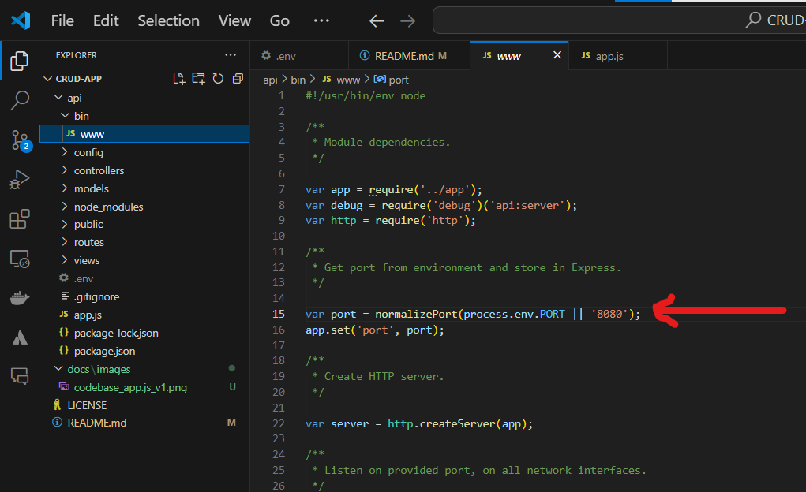

# CRUD-App
React + Node.js + Express + PostgreSQL example: Build a CRUD App

## How to start (Expressjs backend api)

```bash
mkdir CRUD-APP
cd CRUD-APP
```

### Create Express App

```bash
npx express-generator api
cd api
npm install
npm start
```

Install Dependencies

### Create Express App

In api folder run the next command to install necessary packages

```bash
npm install express sequelize pg pg-hstore body-parser cors --save
```

add this code to app.js

```bash
var bodyParser = require("body-parser");
var cors = require("cors");
require('dotenv').config()

...

// use cors
app.use(cors(corsOptions));
// parse requests of content-type - application/json
app.use(bodyParser.json());
// parse requests of content-type - application/x-www-form-urlencoded
app.use(bodyParser.urlencoded({ extended: true }));
```

It should look like this:


express app default port is 3000, set it to 8080 in file api/bin/www like this



### Configure  PostgreSQL  database & Sequelize

In the app folder, we create a separate config folder for configuration with db.config.js file like this:

```js
module.exports = {
    HOST: process.env.DB_HOST,
    USER: process.env.DB_USER,
    PASSWORD: process.env.DB_PASSWORD,
    DB: process.env.DB_NAME,
    dialect: process.env.DB_DIALECT,
    PORT: process.env.DB_PORT,
    pool: {
      max: parseInt(process.env.DB_POOL_MAX),
      min: parseInt(process.env.DB_POOL_MIN),
      acquire: parseInt(process.env.DB_POOL_ACQUIRE),
      idle: parseInt(process.env.DB_POOL_IDLE)
    }
  };
```

under api directory add this file as .env for express to read variable values

```
DB_HOST=localhost
DB_USER=crudappuser
DB_PASSWORD=crudapppwd
DB_NAME=crudappdb
DB_DIALECT=postgres
DB_PORT=5433
DB_POOL_MAX=5
DB_POOL_MIN=0
DB_POOL_ACQUIRE=30000
DB_POOL_IDLE=10000
```

#### Initialize Sequelize

Now create app/models/index.js with the following code:

``` js
const dbConfig = require("../config/db.config.js");

const Sequelize = require("sequelize");
const sequelize = new Sequelize(dbConfig.DB, dbConfig.USER, dbConfig.PASSWORD, {
  host: dbConfig.HOST,
  dialect: dbConfig.dialect,
  operatorsAliases: false,
  port: dbConfig.PORT,
  pool: {
    max: dbConfig.pool.max,
    min: dbConfig.pool.min,
    acquire: dbConfig.pool.acquire,
    idle: dbConfig.pool.idle
  }
});

const db = {};

db.Sequelize = Sequelize;
db.sequelize = sequelize;

db.tutorials = require("./tutorial.model.js")(sequelize, Sequelize);

module.exports = db;
```

Don’t forget to call sync() method in server.js:

```js
const app = express();
app.use(...);

const db = require("./app/models");
db.sequelize.sync();
```

In development, you may need to drop existing tables and re-sync database. Just use force: true as following code:

```js
db.sequelize.sync({ force: true }).then(() => {
  console.log("Drop and re-sync db.");
});
```

#### Define the Sequelize Model

In models folder, create tutorial.model.js file like this:

```js
module.exports = (sequelize, Sequelize) => {
  const Tutorial = sequelize.define("tutorial", {
    title: {
      type: Sequelize.STRING
    },
    description: {
      type: Sequelize.STRING
    },
    published: {
      type: Sequelize.BOOLEAN
    }
  });

  return Tutorial;
};
```

#### Create Controllers

Inside app/controllers folder, let’s create tutorial.controller.js with these CRUD functions:

create
findAll
findOne
update
delete
deleteAll
findAllPublished

```js
const db = require("../models");
const Tutorial = db.tutorials;
const Op = db.Sequelize.Op;

// Create and Save a new Tutorial
exports.create = (req, res) => {
  
};

// Retrieve all Tutorials from the database.
exports.findAll = (req, res) => {
  
};

// Find a single Tutorial with an id
exports.findOne = (req, res) => {
  
};

// Update a Tutorial by the id in the request
exports.update = (req, res) => {
  
};

// Delete a Tutorial with the specified id in the request
exports.delete = (req, res) => {
  
};

// Delete all Tutorials from the database.
exports.deleteAll = (req, res) => {
  
};

// Find all published Tutorials
exports.findAllPublished = (req, res) => {
  
};
```

#### Run the Node.js Express Server

```bash
npm start
```

## React.js Front-end

Setup React.js Project

```bash
cd CRUD-APP
npx create-react-app client
```

Import Bootstrap to  React CRUD App
```bash
cd client
npm install bootstrap
```

Open client/src/App.js and add this import at the top

```js
import "bootstrap/dist/css/bootstrap.min.css";
```

### Add React Router to React CRUD App

Import Bootstrap to  React CRUD App
```bash
npm install react-router-dom
```

Open src/index.js and wrap App component by BrowserRouter object.


### Initialize Axios for React CRUD HTTP Client
Let’s install axios with command:
```bash
npm install axios
```
Under src folder, we create http-common.js file with following code:
```js
import axios from "axios";

export default axios.create({
  baseURL: "http://localhost:8080/api",
  headers: {
    "Content-type": "application/json"
  }
});
```
### Create Data Service

In this step, we’re gonna create a service that uses axios object above to send HTTP requests.

services/tutorial.service.js

```js
import http from "../http-common";

class TutorialDataService {
  getAll() {
    return http.get("/tutorials");
  }

  get(id) {
    return http.get(`/tutorials/${id}`);
  }

  create(data) {
    return http.post("/tutorials", data);
  }

  update(id, data) {
    return http.put(`/tutorials/${id}`, data);
  }

  delete(id) {
    return http.delete(`/tutorials/${id}`);
  }

  deleteAll() {
    return http.delete(`/tutorials`);
  }

  findByTitle(title) {
    return http.get(`/tutorials?title=${title}`);
  }
}

export default new TutorialDataService();

```

### Add Navbar to React CRUD App

Open src/App.js, this App component is the root container for our application, it will contain a navbar, and also, a Routes object with several Route. Each Route points to a React Component.

```js
import React, { Component } from "react";
...

class App extends Component {
  render() {
    return (
      <div>
        <nav className="navbar navbar-expand navbar-dark bg-dark">
          <a href="/tutorials" className="navbar-brand">
            bezKoder
          </a>
          <div className="navbar-nav mr-auto">
            <li className="nav-item">
              <Link to={"/tutorials"} className="nav-link">
                Tutorials
              </Link>
            </li>
            <li className="nav-item">
              <Link to={"/add"} className="nav-link">
                Add
              </Link>
            </li>
          </div>
        </nav>

        <div className="container mt-3">
          <Routes>
            <Route path="/" element={<TutorialsList/>} />
            <Route path="/tutorials" element={<TutorialsList/>} />
            <Route path="/add" element={<AddTutorial/>} />
            <Route path="/tutorials/:id" element={<Tutorial/>} />
          </Routes>
        </div>
      </div>
    );
  }
}

export default App;

```